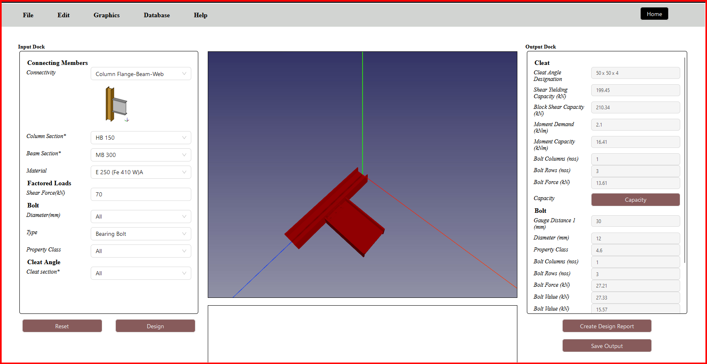

# Osdag on Cloud Setup and Contributions

## Setting Up Osdag on Cloud

refer to https://github.com/osdag-admin/Osdag-web for setting up osdag on cloud.

<!-- To set up Osdag on Cloud--screening task, follow these specific steps:

1. **Update Package Lists and Install Dependencies**:  
   Open your terminal and run the following commands:
   ```bash
   sudo apt-get update
   sudo apt-get install -y texlive-latex-extra
   ```

2. **Extract the Osdag Web ZIP File**:  
   Download the Osdag web application ZIP file and extract it. Navigate to the extracted folder.

3. **Activate Your Conda Environment**:  
   Activate your conda environment (if applicable) using the command:
   ```bash
   conda activate
   ```

4. **Enter the PostgreSQL Terminal**:  
   Access the PostgreSQL terminal by running:
   ```bash
   sudo -u postgres psql
   ```

5. **Create a New Role**:  
   In the PostgreSQL terminal, create a new role for the Osdag developer:
   ```sql
   CREATE ROLE osdagdeveloper PASSWORD 'password' SUPERUSER CREATEDB CREATEROLE INHERIT REPLICATION LOGIN;
   ```

6. **Create a New Database**:  
   Next, create a new database with the newly created role:
   ```sql
   CREATE DATABASE "postgres_Intg_osdag" WITH OWNER osdagdeveloper;
   ```

7. **Exit the PostgreSQL Terminal**:  
   To exit the PostgreSQL terminal, type:
   ```sql
   \q
   ```

8. **Navigate to the Osdag Web Directory**:  
   Change your directory to the cloned Osdag web folder:
   ```bash
   cd path/to/extracted/Osdag-web
   ```

9. **Switch to the Develop Branch**:  
   Ensure you are on the develop branch:
   ```bash
   git checkout develop
   ```

10. **Install Required Python Packages**:  
    Install the necessary Python packages specified in `requirements.txt`:
    ```bash
    pip install -r requirements.txt
    ```

11. **Configure the PostgreSQL Database**:  
    Run the following commands to set up the database:
    ```bash
    python populate_database.py
    python update_sequences.py
    python manage.py migrate
    ```

12. **Install Node.js Dependencies**:  
    Navigate to the Osdag client directory and install Node.js dependencies:
    ```bash
    cd osdagclient
    npm install
    cd ..
    ```

13. **Start the Django Server**:  
    Launch the Django development server:
    ```bash
    python manage.py runserver 8000
    ```

14. **Run the Client Development Server**:  
    Open another terminal window, navigate to the Osdag client folder, and run:
    ```bash
    cd osdagclient
    npm run dev
    ```

15. **Access the Application**:  
    Open your web browser and navigate to:
    ```
    http://localhost:5173/
    ``` -->

## My Screening Task Contributions

As part of the screening task for the Osdag on Cloud project, I focused on developing key features and functionalities that enhance the application's usability and performance. 
Below are my contributions in brief:

1. **UI Development for Cloud Module**:  
   Created a user interface for the Osdag cloud module that mirrors the functionality of the desktop version, ensuring a consistent user experience across platforms.

2. **Cleat Angle Endpoint Development**:  
   Developed an endpoint for the cleat angle, modeled after the already implemented fin plate and end plate modules. This involved creating an input data folder that contains `cleatangleinputdata`, `fin_plate_input_data`, and `input_data_base`, which accept user data and manage connectivity and error handling.

3. **Menu Items Configuration**:  
   Created a `menuitems.json` file to include items from both the fin plate and cleat angle modules, allowing for reusability and flexibility. Modified the code to support multiple sessions.

4. **API Logic for Cleat Angle Connection Module**:  
   Developed the API logic for the cleat angle connection module with several key functions:
   - modified an api to handle both cleat angle and fin plate connections.
   - then the angles are populated in case of cleat angle connections
   - the required keys are validated i.e. Checked that all required parameters are provided and of the correct data type.
   - using create module an instance is created of the cleat angle connection module design class.
   - from input values instantiates the module design class using input values.
   - modified the calculation logic so that the input can be handled for cleat angle and fin plate sessions.
   - then a CAD model is generated from the input values and returns the file path.

5. **Integration with Connection Flow**:  
   Created a `cleat_angle_connection` under the connection flow to facilitate input passing and output generation in the Osdag API modules. Updated the different files to include the new module in the system's architecture.

## Screenshots

### Frontend Cleat Angle 



### Output Data Screenshot


### Input Data Screenshot


